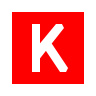

<!-- Header Banner with Animation -->

  

<!-- Introduction with Typing Animation -->
<h1 align="center">
  
</h1>

<!-- Profile Views and GitHub Stats -->

  
  
  

<!-- Social Media Links -->

  
  
  

 

<!-- About Me Section -->
<h2>
   
  About Me
</h2>

Hey there, and welcome.

I’m Mehdi Ayoub Rabiai—a data scientist, a builder, and a believer in using technology to make something better, even if it's just one small part of the world. I’m passionate about AI not just because it’s powerful, but because it’s a space where curiosity, creativity, and discipline all collide. And in that collision, I’ve found something that feels like home.

I don’t have all the answers, and I never claim to. I ask questions, I make mistakes, and I learn—always. I believe in putting in the work quietly, letting results speak, and lifting others when I can.

This GitHub is where I share things I’ve built, ideas I’ve explored, and projects that challenged me to grow. Some of it’s polished. Some of it’s scrappy. But all of it is real.

Thanks for stopping by.
 

<!-- Areas of Expertise Section -->
<h2>
   
  Areas of Expertise
</h2>

  

    
    
    

    
    
  

 

  <table border="0" cellspacing="0" cellpadding="0">
    <tr>
      <td align="center" width="33%">
         
        <strong>Machine Learning</strong> 
        <small>Building scalable models that learn patterns and adapt to data.</small>
      </td>
      <td align="center" width="33%">
         
        <strong>Computer Vision</strong> 
        <small>Designing systems that extract meaning from images and video.</small>
      </td>
      <td align="center" width="33%">
         
        <strong>Deep Learning</strong> 
        <small>Developing neural architectures for complex, high-dimensional tasks.</small>
      </td>
    </tr>
    <tr>
      <td align="center">
         
        <strong>Natural Language Processing</strong> 
        <small>Working with text and language to build intelligent communication systems.</small>
      </td>
      <td align="center">
         
        <strong>Data Science</strong> 
        <small>Extracting insight, building pipelines, and solving problems with data.</small>
      </td>
      <td align="center">
         
        <strong>Biometric Systems</strong> 
        <small>Engineering identity solutions using biological signals and secure design.</small>
      </td>
    </tr>
  </table>

 

<!-- Projects Section -->
<h2>
   
  Featured Projects
</h2>

  <!-- Project 1 -->
  

    <h3 style="color: #9D50BB;">Arabic Handwriting Recognition System</h3>
    
<strong>PAIS 2025 International Conference</strong>

    
Developed an OCR hybrid system combining CNNs and Transformers for fine classification of handwritten Arabic letters, achieving 96.38% accuracy on the IFN/ENIT dataset using an ensemble model (EfficientNet-B7 + ViT-B16).

    

      
      
      
      
    

    
  

  
  <!-- Project 2 -->
  

    <h3 style="color: #9D50BB;">DeepTweet: Arabic Dialect Classification</h3>
    
<strong>NADI Shared Tasks 2024 - 3rd Place</strong>

    
Developed NLP models to identify Arabic dialects across 21 countries, designed to improve linguistic recognition and analysis with accuracy reaching 72%. Implemented multi-classifier ensemble with weighted voting and TF-IDF features.

    

      
      
      
      
    

    
  

  
  <!-- Project 3 -->
  

    <h3 style="color: #9D50BB;">Intracranial Hemorrhage Detection System</h3>
    
<strong>Medical Imaging Research</strong>

    
Developing deep learning models to identify intracranial hemorrhages from medical images. Analyzing and preprocessing over one million images from the RSNA dataset using big data techniques and computer vision.

    

      
      
      
      
    

    
  

  
  <!-- Project 4 -->
  

    <h3 style="color: #9D50BB;">Iris Recognition: Advanced Biometric Identification System</h3>
    
<strong>Academic Research Project</strong>

    
Developed iris recognition systems using KNN, CNN, and Gabor filters with comprehensive preprocessing including segmentation, achieving up to 98% accuracy rate for biometric identification.

    

      
      
      
      
    

    
  

  
  <!-- Project 5 -->
  

    <h3 style="color: #9D50BB;">Facial Recognition & Gesture Recognition System</h3>
    
<strong>Caisse Nationale des Retraites (CNR)</strong>

    
Developed and integrated facial recognition technology for retiree authentication and an AI gesture recognition system with specific training. Created an ergonomic user interface with authentication and file management modules.

    

      
      
      
      
    

    
  

  
  <!-- Project 6 -->
  

    <h3 style="color: #9D50BB;">Banking Fraud Detection System</h3>
    
<strong>Algeria E-Banking Services – Beyn.io</strong>

    
Currently developing an advanced fraud detection system for electronic banking services, implementing machine learning algorithms to identify suspicious patterns and prevent fraudulent transactions.

    

      
      
      
      
    

    
  

 

<!-- Education & Experience Section -->
<h2>
   
  Education & Experience
</h2>

  <table border="0" cellspacing="0" cellpadding="0" style="width: 85%; max-width: 700px;">
    <tr>
      <td width="20%" align="center">
        
      </td>
      <td width="80%">
        <strong style="color: #9D50BB;">Master en Analyse et Sciences de Données</strong> 
        Université Benyoucef Benkhedda d'Alger, Algérie 
        <small>Advanced studies in data analysis, machine learning, and AI applications</small>
      </td>
    </tr>
    <tr>
      <td align="center">
        
      </td>
      <td>
        <strong style="color: #9D50BB;">Licence en Systèmes Informatiques (SI)</strong> 
        Université Benyoucef Benkhedda d'Alger, Algérie 
        <small>Foundation in computer systems, programming, and software development</small>
      </td>
    </tr>
    <tr>
      <td align="center">
        
      </td>
      <td>
        <strong style="color: #9D50BB;">Stagiaire en Solutions d'Intelligence Artificielle</strong> 
        Algeria E-Banking Services – Beyn.io 
        <small>Developing fraud detection systems for electronic banking services</small>
      </td>
    </tr>
    <tr>
      <td align="center">
        
      </td>
      <td>
        <strong style="color: #9D50BB;">Stagiaire en Ingénierie Logicielle</strong> 
        Caisse Nationale des Retraites (CNR), Alger 
        <small>Developed facial and gesture recognition systems for retiree authentication</small>
      </td>
    </tr>
  </table>

 

<!-- Technologies & Tools Section -->
<h2>
   
  Technologies & Tools
</h2>

  
  <!-- Programming Languages -->
  <h3>Programming Languages</h3>
  

    
    
    
    
    
    
    
  

  
  <!-- ML/DL Frameworks -->
  <h3>AI & ML Frameworks</h3>
  

    
    
    
    
    
    
  

  
  <!-- Data Science Tools -->
  <h3>Data Science Tools</h3>
  

    
    
    
    
    
    
  

  
  <!-- Development Tools -->
  <h3>Development Tools</h3>
  

    
    
    
    
    
    
    
  

 

<!-- Languages Section -->
<h2>
   
  Languages
</h2>

  <table border="0" cellspacing="0" cellpadding="0" style="width: 70%; max-width: 600px;">
    <tr>
      <td width="33%" align="center">
        
        

      </td>
      <td width="33%" align="center">
        
        

      </td>
      <td width="33%" align="center">
        
        

      </td>
    </tr>
  </table>

 

<!-- Personal Skills Section -->
<h2>
   
  Personal Skills
</h2>

  

    
    
    
    
    
  

 

<!-- Footer Section -->

  

  

<!-- Note: Replace "your-github-username" with your actual GitHub username -->
<!-- Note: Update social media links with your actual profile links -->
